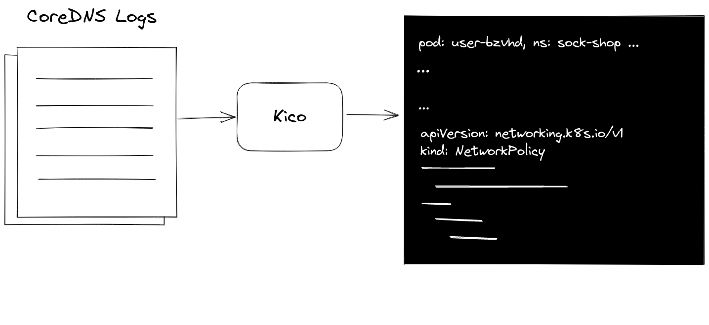
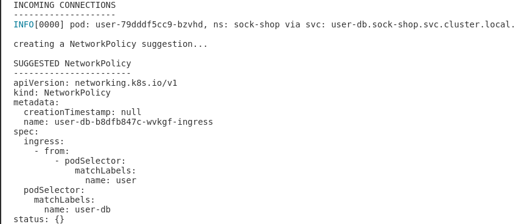
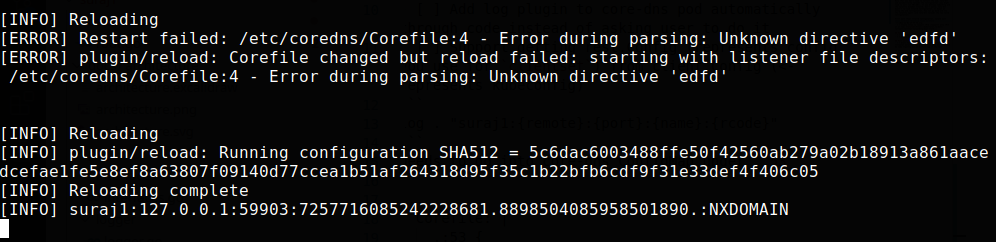

# Kico
`kico` shows incoming connections to your pod(s) from other pods and suggests a NetworkPolicy to allow those connections



## Quickstart
1. Download the binaries from the release page.
2. Enable logging for CoreDNS by enabling `log` (built-in) plugin in `coredns` ConfigMap in `kube-system` namespace.
```
kubectl edit configmap coredns -n kube-system
```
Put it under `.:53` (catch-all zone) like this:
```
  Corefile: |
    .:53 {
        errors
        log
        health
```
Or some other [server block](https://coredns.io/manual/configuration/#server-blocks) if you know what you are doing. 

Note that you don't need to restart the pod. CoreDNS pod automatically reloads the configuration ([don't worry about messing up the configuration](#faq)).  
3. Use `kico` to find incoming connections to your pod
```
kico user-db-b8dfb847c-wvkgf --suggest-netpol -n sock-shop
```


## Supported Flags
```
Usage:
  kico <pod-name> [flags]

Flags:
  -c, --concurrency int        Sets concurrency for processing logs (default: 4) (default 4)
  -h, --help                   help for kico
  -n, --namespace string       Namespace where the pod exists (default: uses current namespace
  -s, --suggest-netpol         Suggests a NetworkPolicy if the flag is set (default: false
  -t, --toggle                 Help message for toggle
  -w, --wait-for-logs string   Waits for relevant logs to appear (default: 60s (default "60s")
```
## Good to know
1. Mentioning `<pod-name>` in `kico <pod-name>` command is just give the users convenience of specfiying a `<pod-name>` instead of finding the service name (extra work). `kico` uses `<pod-name>` to figure out the Kubernetes Service name (`<pod-name>` has no use outside this). So, if a K8s Service points to `<pod-name-1>`, `<pod-name-2>`.. and so on,  you can use any of the pod names in the command e.g., `kico <pod-name-1/2/3..>`
2. `kico` ignores `pod-template-hash` label on pods because it is not useful in creating the K8s `NetworkPolicy` resource.
3. `kico` by default waits for 60s for the relevant connection logs printed by the `log` CoreDNS plugin. It gives up and exists after 60s. This time duration is configurable using `--wait-duration` flag (check [Supported Flags](#supported-flags)).
4. You can set log level of `kico` using `LOG_LEVEL` environment variable
```
LOG_LEVEL=debug kico user-db-b8dfb847c-wvkgf -nsock-shop
```
You will see additional debug logs like these:
```
DEBU[0000] coredns-b96499967-mjdrn: looking for relevant logs in the coredns pod logs 
DEBU[0000] [INFO] 10.42.2.93:46045 - 245 "A IN user-db.sock-shop.svc.cluster.local. udp 53 false 512" NOERROR qr,aa,rd 104 0.000133232s 
DEBU[0000] coredns-b96499967-mjdrn: relevant logs found :) 
DEBU[0000] coredns-b96499967-w7t8t: looking for relevant logs in the coredns pod logs 
DEBU[0000] [INFO] 10.42.2.93:38771 - 56214 "A IN user-db.sock-shop.svc.cluster.local. udp 53 false 512" NOERROR qr,aa,rd 104 0.000182001s 
DEBU[0000] coredns-b96499967-w7t8t: relevant logs found :) 
```

## What problem is `kico` trying to solve?
Consider the following cases:
1. Your want to implement a cluster wide `NetworkPolicy` related change e.g., [a policy to deny all ingress traffic to pods](https://kubernetes.io/docs/concepts/services-networking/network-policies/#default-deny-all-ingress-traffic). You need to add correct `NetworkPolicy` to your workloads so that they work correctly. This involves manual work and doesn't scale well if you have a lot of workloads. 
2. You want to identify which policy should be added so that your pod accepts incoming connections only from specific pod(s) (for security and other reasons). Same as 1. You need to manually identify which pods are trying to connect to your pod (by say checking if your pod's Service FQDN is used as an environment variable in other pods).
3. You are curious about knowing which pods are connecting to your pod.

`kico` attempts to provide a solution to these and other problems.  

## FAQ
### 1. What happens if I make a mistake in the CoreDNS Config (aka Corefile)?
If you mistype something and the Corefile becomes invalid, don't worry. CoreDNS doesn't re-load invalid configuration. It keeps on using the old configuration. You can go back and fix the Corefile again (and CoreDNS reloads the new valid configuration without re-starting its pods)

First part shows invalid configuration, second part shows core-dns reloading fixed Corefile


### 2. What does the name `kico` mean?
`kico` is a short-form for "**K**ubernetes **I**ncoming **CO**nnections"

## Caveats
- For CoreDNS,  
_"[`Note that for busy servers logging will incur a performance hit.`](https://coredns.io/plugins/log/)"_
- `kico` figures out the incoming connections based on the logs. If there were some connections which were not logged in CoreDNS e.g., connections which directly connect using target pod IP or if CoreDNS pod restarts, `kico` can't show such connections because it uses CoreDNS logs.

## Feedback
If you have any thoughts, questions, suggestions, opinions, feature requests etc., [open an issue](https://github.com/vadasambar/kico/issues/new). I would love to hear your feedback. 

## Contribution
Check [open issues](https://github.com/vadasambar/kico/issues) (I am still refining them). Please comment `@vadasambar` on the issue if you find it interesting. 

Feel free to open a PR/issue if you are interested in contributing. `kico` follows [Conventional Commits](https://www.conventionalcommits.org/en/v1.0.0/) for commit messages.